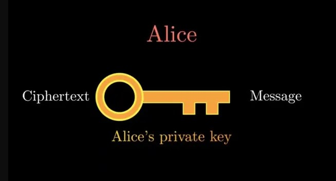

# Manim Animation Video Explaining Public Key Encryption and the RSA Algorithm

## Watch the full video by visiting https://www.youtube.com/watch?v=_IzZgqtvgEI

## Parts of the Video
### Introduction

This part of the video introduces the concept of computer cryptography. A real world example is given. All code for this section of the video can be found in `intro_encryption.py`.

### Public Key Encryption

This part of the video explains how public key encryption works in general. The classic Alice and Bob example is animated. All code for this section of the video can be found in `public_key_encryption.py`.

### The RSA Algorithm

This part of the video explains the RSA Algorithm and includes a proof of correctness for it. All code for this section of the video can be found in `rsa_encryption.py`.

### Conclusion

This is the conclusion of the video. Key concepts are summarized and the real world example provided near the beginning of the video is replayed. All code for this section of the video can be found in `conclude_encryption.py`.

### Full Video

I merged the code from the above four sections into a single file `full_encryption_video.py` so that the full animation can be created using this file alone.

## How to create the Video

Steps:
1. Download `full_encryption_video.py` onto your local computer.
2. Run `manim -pql full_encryption_video.py FullEncryptionVideo` in your terminal under the same directory as `full_encryption_video.py`.
